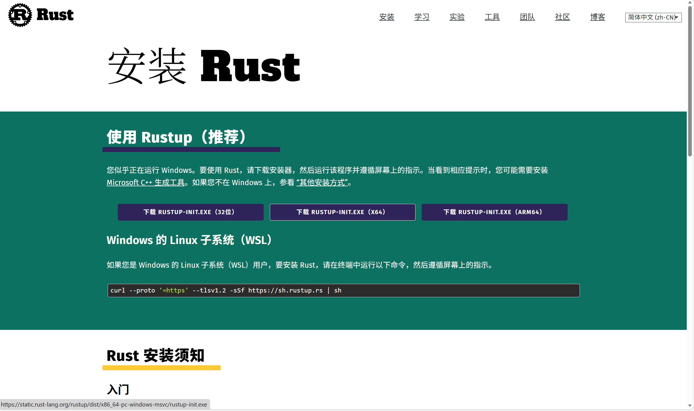
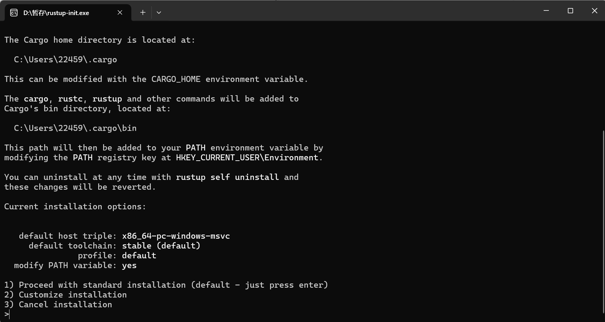
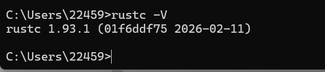
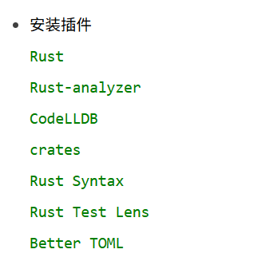
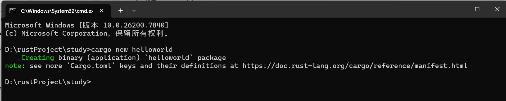
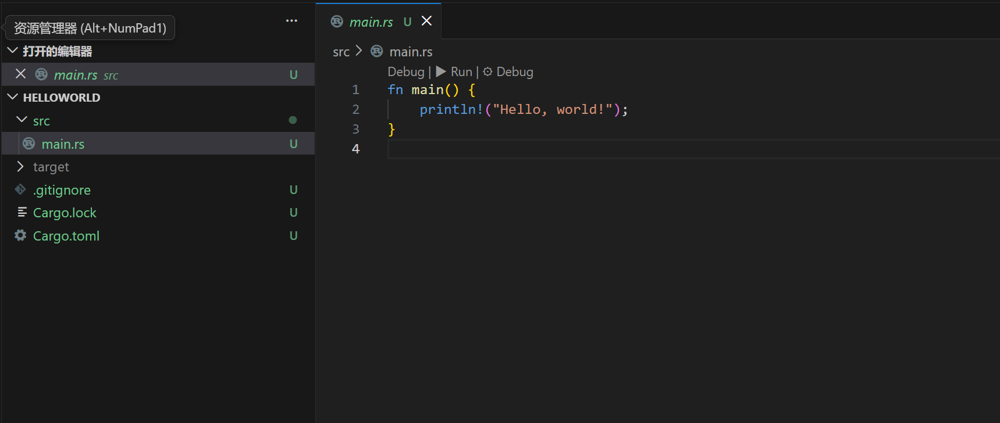
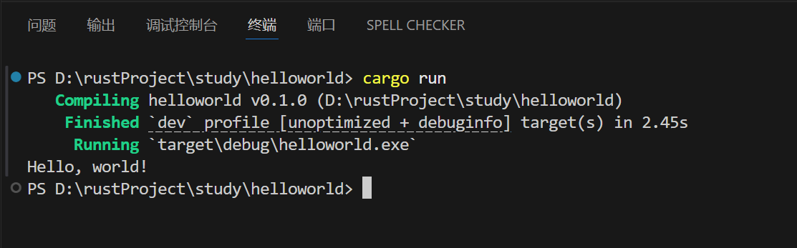
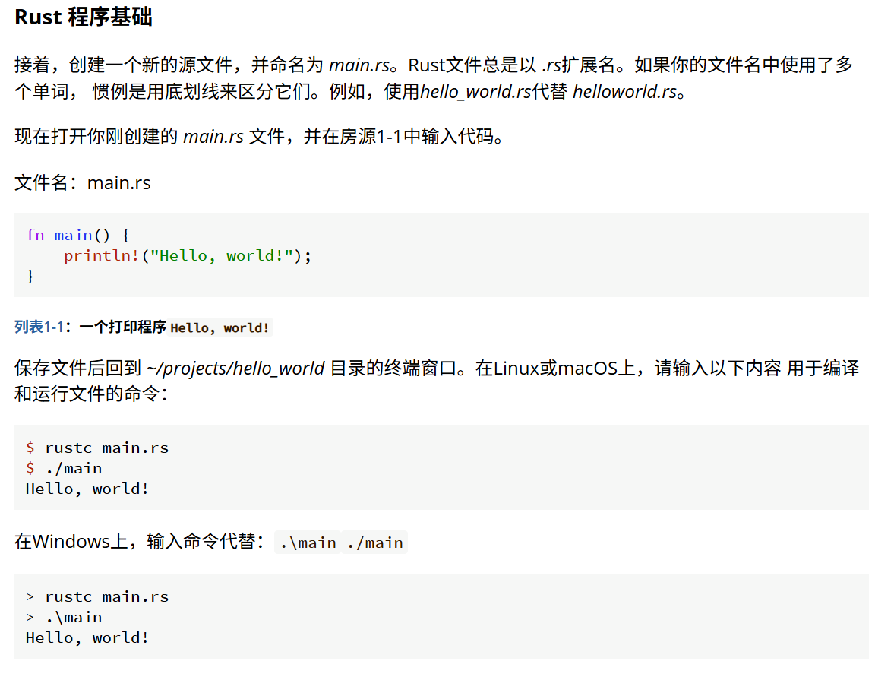

我会在这里写一些rust语言相关的东西
## 1 rust基础配置与输出helloworld
- rust的安装
    https://rust-lang.org/zh-CN/：进入rust官网，下载官网提供的安装器
    
    打开之后，无特殊要求直接回车即可，安装会自动安装rust并配置所需要的环境变量
    
    安装成功之后，打开cmd输入rustc -V,检查是否成功安装并查看rust版本
    
- ide的环境配置
    win环境想要是应用ide编辑rust程序可以使用vscode搭配rust相关的插件：
    
- 使用cargo创建rust项目并运行
    在想要创建项目的目录中打开cmd并输入cargo new 项目名，可以自动创建一个rust的初始项目
    
    用vscode打开，项目的入口main函数在src下
    
    在项目中输入cargo run来执行该项目
    
    Rust是一门静态类型、编译型、系统级编程语言，核心特点是“内存安全且无需垃圾回收（GC）”，编译后会生成可执行的二进制文件
    
    如果不使用cargo的话还可以使用rustc来执行rust程序，官网的教学书里已经给出了具体步骤
    
    但需要注意的是，在书写rust时，每当你更改了你的代码，那么你就需要重新编译出新的exe文件之后才能运行
    但使用cargo就不需要考虑这些，书写完之后保存直接cargo run就行
    